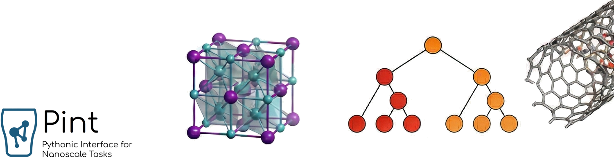

**[Pint](http://sblisesivdin.github.io/pint)** is a powerful and user-friendly user interface (UI) tool for conducting Density Functional Theory (DFT) and molecular dynamics (MD) calculations. In the near future, machine learning features will be added.

**gpaw-tools** has evolved and is now called **Pint**!

The **gpaw-tools** project began as a script that utilized only ASE and GPAW. Still, over the course of four years, it evolved into code that leverages multiple libraries, including ASAP3, Phonopy, Elastic, OpenKIM, and others. It is now being rewritten to incorporate modern Machine Learning capabilities (MACE, CHGNet, SevenNet) into its structure.

At this point, we have embarked on a new naming convention to better define the software. After this stage, it will be called `Pint`, which stands for Pythonic Interface for Nanoscale Tasks. The `gpaw-tools` project has moved to [Pint's new home](https://github.com/sblisesivdin/pint) to achieve a more comprehensive, modern, and ML-supported structure.

What does this mean for you?

`gpaw-tools (v25.x)`: Has been placed in maintenance mode. No new features will be added except for critical bug fixes.

`Pint (v26.x)`: Includes all the capabilities of gpaw-tools (excluding gg.py), but offers them as a modern Python package (pip install). It also incorporates modern machine learning capabilities such as MACE and CHGNet.

**IMPORTANT INFORMATION: Pint is in a beta phase. Please continue to use gpaw-tools until further notice. You can view the development at [Release Notes](https://github.com/sblisesivdin/pint/blob/main/RELEASE_NOTES.md)** 

Pint and gpaw-tools are distributed with [MIT license](https://github.com/sblisesivdin/pint/blob/main/LICENSE.md).
